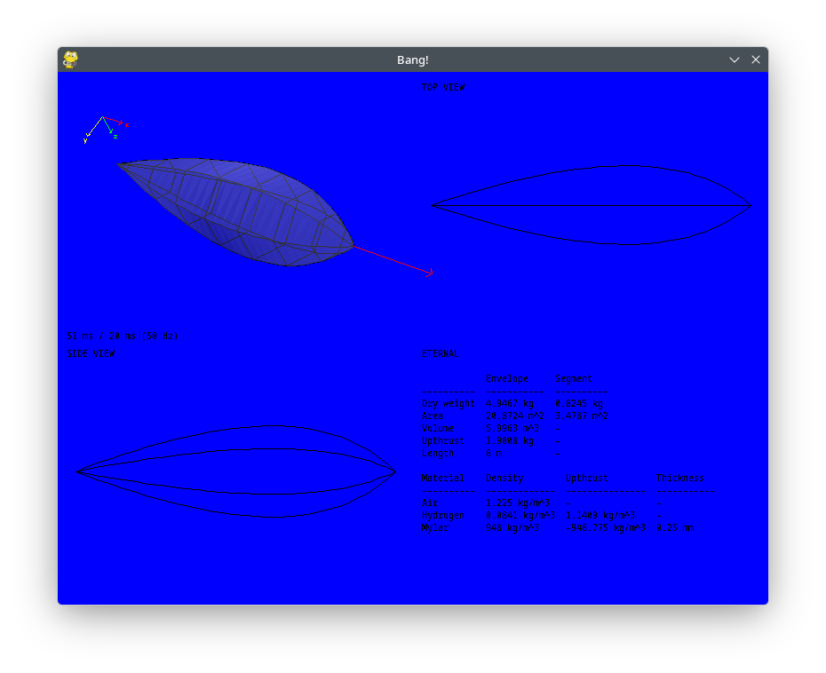

# Blimp Tool

## Running

`make`

Installs all dependancies to a venv and runs the program. Depends on python3.

## Constants

Constants are in `config.py`, currenly the envelope material is Mylar.

## Todo

- Add seam allowence to weight calculation, measured in m offset outwards from the spline which can be used to work out the weight of the allowence.

- Add center of lift and center of mass calculation

- Bake-in the weights into the polygons so that all moves `shapes.py -> envelope.py -> display.py`

- Rename the polygon class

- Add the CFD solver (Lattice-Bosman)

- Re-validate the volume calculator, seems weirdly low